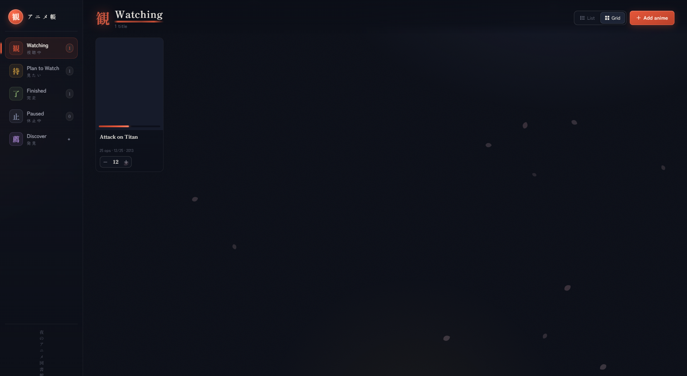
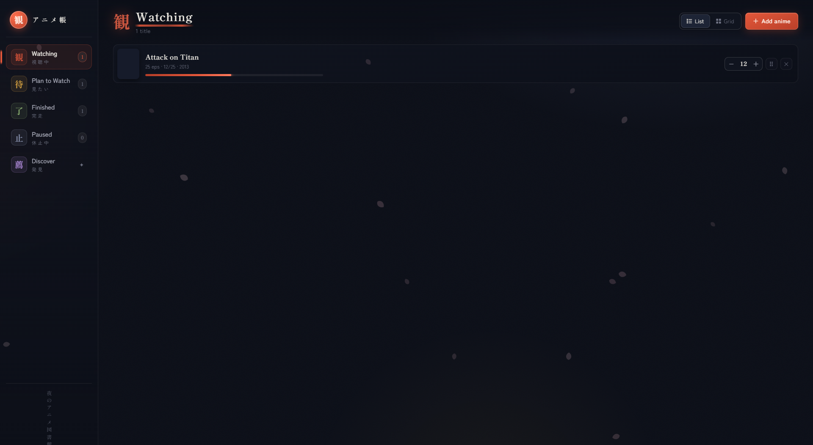
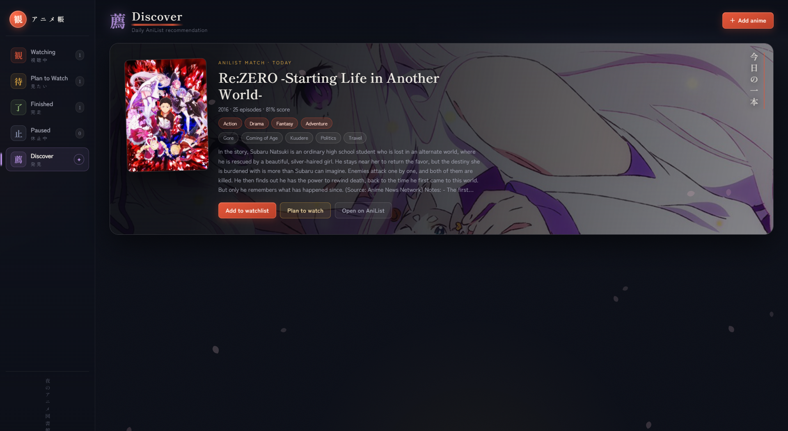
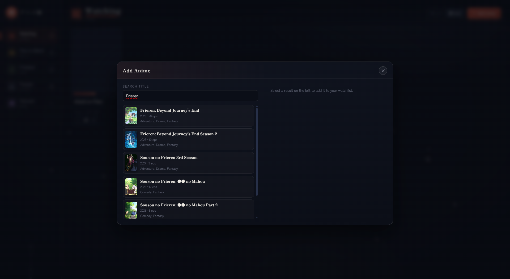

# Watchlist — 夜のアニメ図書館

[](LICENSE)
[](package.json)
[](frontend/src)

**Watchlist** ist eine selbst gehostete Anime-Bibliothek mit japanisch inspiriertem Dark-UI, AniList-Integration, SQLite-Persistenz und optionalem PIN-Schutz. Verwalte deine Titel lokal — ohne Account bei einem Tracking-Dienst.



---

## Inhaltsverzeichnis

- [Features](#features)
- [Screenshots](#screenshots)
- [Tech-Stack](#tech-stack)
- [Voraussetzungen](#voraussetzungen)
- [Installation](#installation)
- [Konfiguration](#konfiguration)
- [Entwicklung](#entwicklung)
- [Produktion](#produktion)
- [Docker](#docker)
- [Nginx-Reverse-Proxy](#nginx-reverse-proxy)
- [API-Übersicht](#api-übersicht)
- [Projektstruktur](#projektstruktur)
- [Lizenz](#lizenz)

---

## Features

### Bibliothek & Status

| Funktion | Beschreibung |
|----------|--------------|
| **Kategorien** | Watching, Plan to Watch, Finished, Paused |
| **Listen- & Grid-Ansicht** | Umschaltbar; Präferenz wird im Browser gespeichert |
| **Episoden-Fortschritt** | `+` / `−` pro Titel, Fortschrittsbalken, „New Episode“-Badge bei neu ausgestrahlten Folgen |
| **Drag & Drop** | Reihenfolge innerhalb einer Kategorie ändern oder Titel per Drag in andere Kategorien verschieben |
| **Kontextmenü** | Rechtsklick: Status ändern, bearbeiten, +1 Episode, löschen |
| **Details-Modal** | Cover, Synopsis, Cast & Voice-Actors (AniList) |

### AniList-Integration

| Funktion | Beschreibung |
|----------|--------------|
| **Suche** | Live-Suche über die AniList-API beim Hinzufügen |
| **Anime of the Day** | Tägliche Empfehlung basierend auf Genres/Tags deiner Bibliothek |
| **Next Airing** | Automatische Aktualisierung von Ausstrahlungsterminen |
| **Top Airing** | Saison-Top-Listen (MAL / AniList) |
| **Duplikat-Schutz** | Gleicher AniList-Eintrag kann nicht doppelt gespeichert werden |

### Sicherheit & Daten

| Funktion | Beschreibung |
|----------|--------------|
| **PIN-Login** | Optionaler 4-stelliger PIN mit Session-Cookie |
| **Rate Limiting** | Schutz vor Brute-Force (Lockout nach Fehlversuchen) |
| **SQLite** | Lokale Datenbank mit WAL-Modus |
| **Import / Export** | JSON-Backup der gesamten Bibliothek |
| **Cache** | AniList-Antworten werden zeitlich gecacht |

### Design

- **夜のアニメ図書館** — Sumi-Tinte, Shu-Vermilion & Kin-Gold
- Animierte Sakura-Petals im Hintergrund
- Shippori Mincho & Zen Kaku Gothic New
- View Transitions beim Tab-Wechsel (wenn vom Browser unterstützt)
- Responsives Layout mit Sidebar-Navigation

---

## Screenshots

### Watching — Listenansicht



### Discover — Tägliche AniList-Empfehlung



### Anime hinzufügen — AniList-Suche



---

## Tech-Stack

| Schicht | Technologie |
|---------|-------------|
| Frontend | React 18, Vite 5, CSS Custom Properties |
| Backend | Node.js 20+, Express 4 |
| Datenbank | SQLite via `better-sqlite3` |
| APIs | AniList GraphQL, MyAnimeList (Top Airing) |
| Deployment | Docker, nginx, systemd |

---

## Voraussetzungen

- **Node.js** ≥ 20 ([nodejs.org](https://nodejs.org/))
- **npm** ≥ 10
- **Build-Tools** für `better-sqlite3`:
  - **Windows:** [Visual Studio Build Tools](https://visualstudio.microsoft.com/visual-cpp-build-tools/) mit „Desktop development with C++“
  - **Linux:** `build-essential`, `python3`
  - **macOS:** Xcode Command Line Tools (`xcode-select --install`)

---

## Installation

### 1. Repository klonen

```bash
git clone https://github.com/Noriko666/Watchlist.git
cd Watchlist
```

### 2. Abhängigkeiten installieren

```bash
npm install
```

> **Windows-Hinweis:** Falls der Server mit `Could not locate the bindings file` für `better-sqlite3` abstürzt:
>
> ```bash
> npm rebuild better-sqlite3
> ```

### 3. Umgebungsvariablen einrichten

```bash
cp .env.example .env
```

Bearbeite `.env` nach Bedarf (siehe [Konfiguration](#konfiguration)).

### 4. Frontend bauen (für Produktion)

```bash
npm run build
```

### 5. Server starten

```bash
npm start
```

Die App ist unter **http://127.0.0.1:4310** erreichbar.

---

## Konfiguration

Kopiere `.env.example` nach `.env` und passe die Werte an:

| Variable | Standard | Beschreibung |
|----------|----------|--------------|
| `NODE_ENV` | `production` | `development` oder `production` |
| `PORT` | `4310` | HTTP-Port des Servers |
| `HOST` | `127.0.0.1` | Bind-Adresse (`0.0.0.0` für Netzwerk-Zugriff) |
| `DATABASE_FILE` | `./data/watchlist.sqlite` | Pfad zur SQLite-Datei |
| `WATCHLIST_PASSWORD` | *(leer)* | 4-stelliger PIN; leer = kein Login |
| `WATCHLIST_SESSION_SECRET` | *(leer)* | Zufälliger String (≥ 32 Zeichen), **Pflicht wenn PIN gesetzt** |
| `CACHE_TTL_HOURS` | `24` | AniList-Cache-Gültigkeit |
| `TRUST_PROXY` | `loopback` | Setze auf `true` hinter nginx |

### PIN-Schutz aktivieren (empfohlen für öffentliche Deployments)

```env
NODE_ENV=production
HOST=127.0.0.1
PORT=4310
WATCHLIST_PASSWORD=1234
WATCHLIST_SESSION_SECRET=ein-langer-zufaelliger-string-mindestens-32-zeichen
TRUST_PROXY=true
```

> `WATCHLIST_SESSION_SECRET` darf **nicht** gleich dem PIN sein und darf nicht der Platzhalter `change-me-before-public-use` sein.

---

## Entwicklung

Startet Backend (Port 4310) und Vite-Dev-Server (Port 5173) parallel:

```bash
npm run dev
```

Öffne **http://localhost:5173** — API-Anfragen werden automatisch an den Backend-Port weitergeleitet.

| Befehl | Beschreibung |
|--------|--------------|
| `npm run dev` | Backend + Frontend parallel |
| `npm run dev:server` | Nur Express mit Nodemon |
| `npm run dev:client` | Nur Vite |
| `npm run build` | Produktions-Build nach `dist/` |
| `npm run assets` | Platzhalter-PNGs für `frontend/public/anime-ui/` erzeugen |
| `npm start` | Produktionsserver (benötigt `dist/`) |

---

## Produktion

### Manuell

```bash
npm ci
npm run build
NODE_ENV=production node backend/server.js
```

### systemd (Linux)

Beispiel-Unit liegt unter `deploy/watchlist.service`:

```bash
sudo cp deploy/watchlist.service /etc/systemd/system/
# EnvironmentFile anlegen, z. B. /etc/watchlist.env
sudo systemctl enable --now watchlist
```

---

## Docker

```bash
cp .env.example .env
# .env anpassen (PIN + Secret setzen!)

docker compose up -d --build
```

Die App läuft auf Port **4310**. Daten werden in `./data` gemountet.

---

## Nginx-Reverse-Proxy

Beispiel-Konfiguration: `deploy/nginx.watchlist.conf` — Unterpfad `/watchlist/`

```nginx
location ^~ /watchlist/ {
    proxy_pass http://127.0.0.1:4310/;
    proxy_http_version 1.1;
    proxy_set_header Host $host;
    proxy_set_header X-Real-IP $remote_addr;
    proxy_set_header X-Forwarded-For $proxy_add_x_forwarded_for;
    proxy_set_header X-Forwarded-Proto $scheme;
}
```

Setze in `.env`: `TRUST_PROXY=true`

---

## API-Übersicht

| Methode | Endpunkt | Beschreibung |
|---------|----------|--------------|
| `GET` | `/api/health` | Health-Check |
| `GET` | `/api/auth/session` | Session-Status |
| `POST` | `/api/auth/login` | PIN-Login |
| `POST` | `/api/auth/logout` | Abmelden |
| `GET` | `/api/anime` | Alle Einträge |
| `POST` | `/api/anime` | Eintrag anlegen |
| `PATCH` | `/api/anime/:id` | Eintrag aktualisieren |
| `DELETE` | `/api/anime/:id` | Eintrag löschen |
| `POST` | `/api/anime/reorder` | Reihenfolge ändern |
| `GET` | `/api/search?query=` | AniList-Suche |
| `GET` | `/api/anime-of-the-day` | Tagesempfehlung |
| `GET` | `/api/anime/:id/characters` | Charaktere |
| `GET` | `/api/staff/:id/top-roles` | Voice-Actor-Rollen |
| `GET` | `/api/season-top-airing` | Top Airing |
| `GET` | `/api/export` | JSON-Export |
| `POST` | `/api/import` | JSON-Import |

---

## Projektstruktur

```
Watchlist/
├── backend/
│   ├── server.js          # Express-Server & API-Routen
│   ├── db.js              # SQLite-Schema & Queries
│   ├── anilist.js         # AniList GraphQL-Client
│   ├── mal.js             # MAL Top-Airing
│   └── utils.js           # Hilfsfunktionen
├── frontend/
│   ├── src/
│   │   ├── components/    # React-Komponenten
│   │   ├── lib/           # API-Client, Konstanten, Utils
│   │   └── styles/        # CSS Design System
│   └── public/anime-ui/   # UI-Assets
├── deploy/                # nginx & systemd Beispiele
├── docs/screenshots/      # README-Screenshots
├── scripts/               # Hilfsskripte
├── docker-compose.yml
├── Dockerfile
└── package.json
```

---

## Lizenz

MIT — siehe [LICENSE](LICENSE).

---

<p align="center">
  <strong>観</strong> — Watch with intention.
</p>
